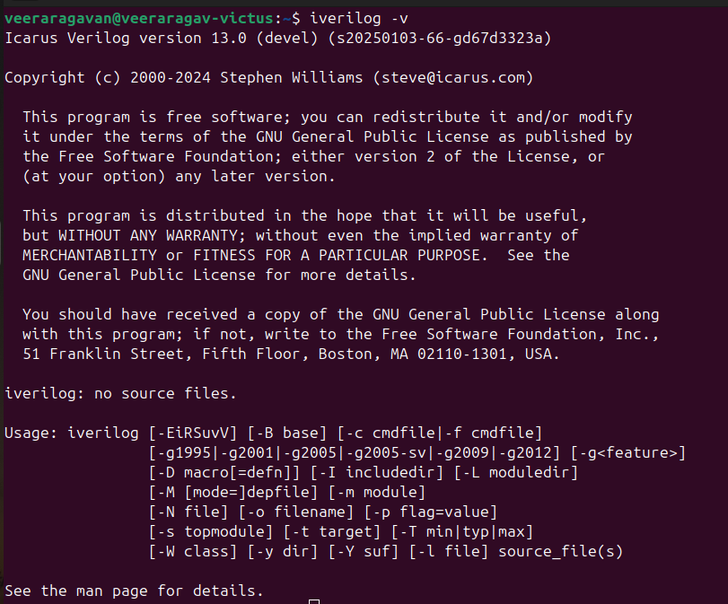
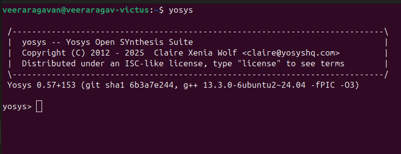
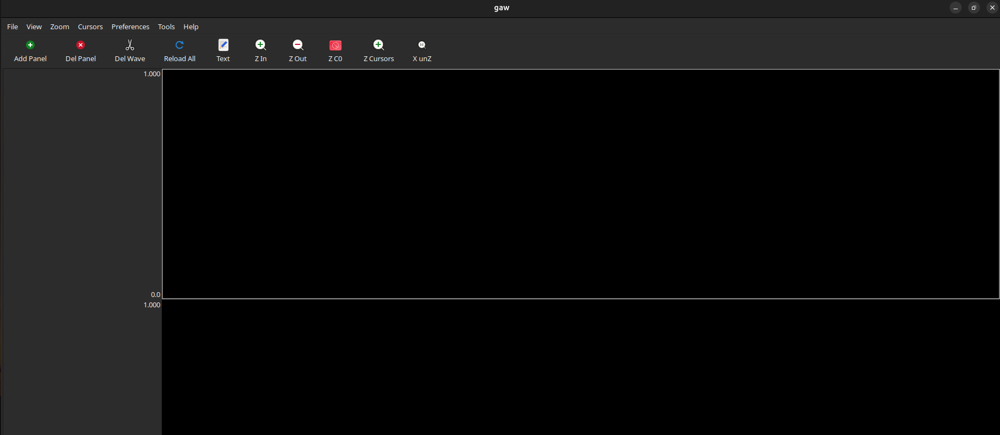

# 🛠️ Task0: Installation Verification of EDA Tools

This document showcases the successful installation and verification of the core open-source EDA tools used in the **RISC-V SoC Tapeout Program VSD**.

---

## ✅ Tools Installed

| Tool | Purpose | Verification Screenshot |
|------|---------|------------------------|
| 🖥️ **Icarus Verilog** | Verilog Simulation & Compilation |  |
| 🧠 **Yosys** | RTL Synthesis & Logic Optimization |  |
| 📊 **GTKWave** | Waveform Viewer & Analysis |  |

---

## 🔍 Verification Commands

Run the following commands to verify installation:

```bash
yosys -V
iverilog -V
gtkwave --version

